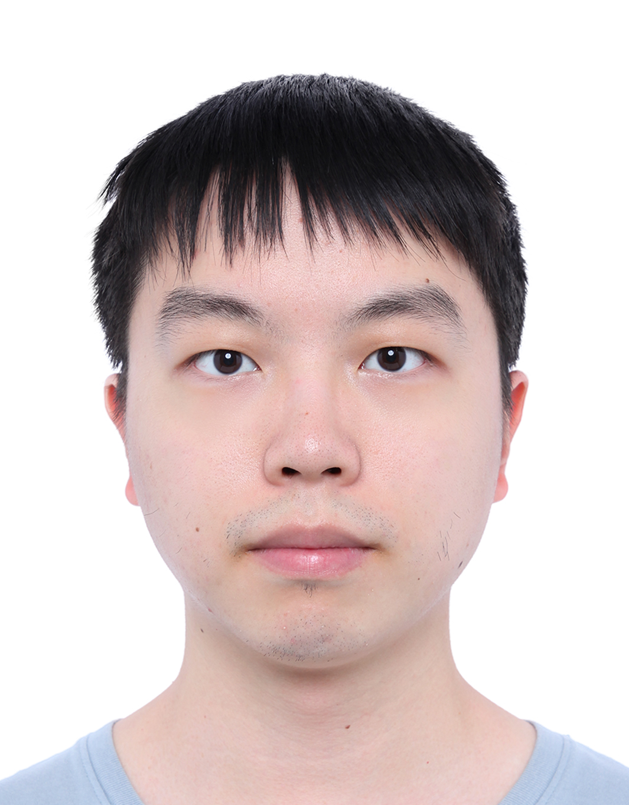

---

# Hi there! 👋

I'm **Kechi Zhang (张克驰)**, currently pursuing my Ph.D. at Peking University, with an expected graduation in June 2026. 

My research is at the fascinating intersection of **AI4SE**, **LLMs for Code**, and **Code Generation and Representation** through deep learning techniques. 

I am passionate about leveraging large language models to enhance software engineering and the way we generate and represent code.

Email: zhangkechi@pku.edu.cn

Homepage: [Google Scholar](https://scholar.google.com/citations?user=6AuwtXwAAAAJ&hl=en)

---

## 🔍 **Research Focus**

- **AI4SE & LLMs for Code**
  - **Code Generation and Representation through Deep Learning**
  - Reinforcement Learning for Long Reasoning Code Models
  - Pre-training, fine-tuning, and alignment of Code LLMs
  - Tool Enhancement and Agent Technology for Code Models
  - Length Extrapolation for Code Models
  - Project-level Code Generation
  - Structural Information-based Code Representation Models

---

## 📚 **Education**

- **Ph.D. in Computer Software and Theory**  
  School of Computer Science, Peking University, Beijing, China  
  *Sept. 2021 - June 2026 (expected)*  
  **Tutor:** Prof. Zhi Jin, Prof. Ge Li

- **B.S. in Computer Science and Technology**  
  School of EECS, Peking University, Beijing, China  
  *Sept. 2017 - July 2021*  
  **GPA:** ~3.60 (Top 25%)

---

## 📝 **Selected Publications**

- **CodeDPO** | *ACL 2025 Main Conference*  
  A preference optimization framework for code models that focuses on both correctness and efficiency without depending on external resources.

- **FocusedDPO** | *ACL 2025 Finding*  
  Fine-graind optimization for code models with Error-Prone Points Identification.

- **CodeAgent** | *ACL 2024 Main Conference*  
  Integrating multiple programming assistance tools into large models for practical problem-solving.
  
- **HiRoPE** | *ACL 2024 Main Conference*  
  Introducing a plug-and-play length extension method for large code models.
  
- **Self-Edit** | *ACL 2023 Main Conference*  
  Early exploration into the self-repair capability of large models in code generation.
  
- **Hierarchy Transformer** | *ICPC 2023* | **🏆ACM SIGSOFT Distinguished Paper Award**  
  A novel Transformer structure for modeling both sequence and structural information in source code.
  
- **Heterogeneous Code GNN** | *ICPC 2022*  
  Proposing a heterogeneous graph representation model for programs.

- **ToolCoder**  
  Tool-enhanced learning method embedding external API search tools into code generation models.
  
- **Code Generation Survey** | *SCIS 2024, CCF-A*  
  A comprehensive survey of code generation.

---

## 🏆 **Honors & Awards**

- **2023 ACM SIGSOFT Distinguished Paper Award**
- **Peking University Outstanding Student Award** (2022, 2023)
- **2023 Peking University Yongying Foundation Scholarship**
- **Peking University Excellent Research Award** (2017-2021)
- **Peking University EECS Scholarship** (2017-2021)
- **2020 Peking University Schlumberger Scholarship**

---

## 📬 **Contact Information**

- **Email:** [zhangkechi@pku.edu.cn](mailto:zhangkechi@pku.edu.cn)  
- **Homepage:** [Google Scholar](https://scholar.google.com/citations?user=6AuwtXwAAAAJ)  
- **Address:** Room No. 1726, No. 1 Science Building, Peking University, No. 5 Yiheyuan Road, Haidian District, 100871 Beijing

---

Feel free to explore my [publications](/publications/).

---
